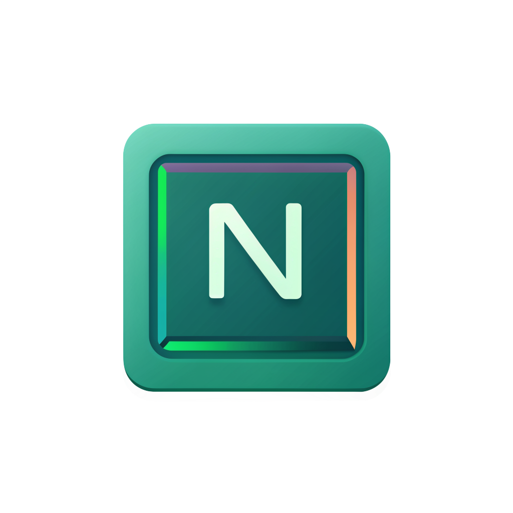

<!-- markdownlint-disable MD013 MD033 MD045 -->

# Nvim UI+

<p align="center">
  <br>
  <b>Nvim UI+</b> - Neovim mode indicator for VSCode
</p>

<p align="center">
<a href="https://marketplace.visualstudio.com/items?itemName=wrathcodes.nvim-ui-plus" target="__blank"></a>
<a href="https://kermanx.github.io/reactive-vscode/" target="__blank"></a>
</p>

## What's this?

Hey there! Nvim UI+ takes your VSCode Neovim experience to the next level by making the UI adapt to your current Vim mode. Think of it as mood lighting for your editor - different colors for different modes so you always know where you are.

## Cool Stuff It Does

- 🌈 **UI that knows your mode**: VSCode's interface changes color based on your Neovim mode
- 📊 **Mode indicator that pops**: The status bar shows your current mode with neat icons and colors
- ⚙️ **Make it yours**: Pick which UI bits change and choose your own colors
- 🔄 **Instant feedback**: See changes immediately when switching between modes

## Before You Install

- You need the [VSCode Neovim extension](https://marketplace.visualstudio.com/items?itemName=asvetliakov.vscode-neovim) installed

## Getting Started

1. Grab the VSCode Neovim extension
2. Install this extension (Nvim UI+)
3. Add a bit of Lua to your Neovim config (see below)
4. Restart VSCode and enjoy!

### Neovim Config Setup

Add this to your Neovim config:

```lua
-- For init.lua
local vscode = require("vscode")

local function notify_vscode_mode()
    local mode = vim.api.nvim_get_mode().mode
    local mode_name = ""
    -- Convert Neovim mode to readable name
    if mode == "n" then
        mode_name = "normal"
    elseif mode == "i" then
        mode_name = "insert"
    elseif mode == "v" then
        mode_name = "visual"
    elseif mode == "V" then
        mode_name = "visual"
    elseif mode == "\22" then
        mode_name = "visual"
    elseif mode == "c" then
        mode_name = "cmdline"
    elseif mode == "R" then
        mode_name = "replace"
    else
        mode_name = mode
    end
    --  Call VSCode extension to update UI asynchronously
    vscode.action("nvim-ui-plus.setMode", {
        args = { mode = mode_name }
    })
end

-- Mode change notification autocmd
vim.api.nvim_create_autocmd("ModeChanged", {
    pattern = "*",
    callback = notify_vscode_mode,
})
```

## Tweaking to Your Taste

You can customize everything through VSCode settings:

<!-- configs -->

| Key                                       | Description                                         | Type      | Default     |
| ----------------------------------------- | --------------------------------------------------- | --------- | ----------- |
| `nvim-ui-plus.enabled`                    | Enable Neovim UI+ theming                           | `boolean` | `true`      |
| `nvim-ui-plus.uiElements.editorCursor`    | Apply mode color to editor cursor                   | `boolean` | `true`      |
| `nvim-ui-plus.uiElements.inputValidation` | Apply mode color to input validation borders        | `boolean` | `true`      |
| `nvim-ui-plus.uiElements.panelTitle`      | Apply mode color to panel titles                    | `boolean` | `true`      |
| `nvim-ui-plus.uiElements.peekView`        | Apply mode color to peek view elements              | `boolean` | `true`      |
| `nvim-ui-plus.uiElements.tabs`            | Apply mode color to tabs                            | `boolean` | `true`      |
| `nvim-ui-plus.uiElements.activityBar`     | Apply mode color to activity bar elements           | `boolean` | `true`      |
| `nvim-ui-plus.uiElements.titleBar`        | Apply mode color to title bar                       | `boolean` | `true`      |
| `nvim-ui-plus.uiElements.statusBar`       | Apply mode color to status bar elements             | `boolean` | `true`      |
| `nvim-ui-plus.uiElements.editor`          | Apply mode color to editor elements like selections | `boolean` | `true`      |
| `nvim-ui-plus.uiElements.suggestWidget`   | Apply mode color to suggestion widget               | `boolean` | `true`      |
| `nvim-ui-plus.uiElements.lineNumbers`     | Apply mode color to active line numbers             | `boolean` | `true`      |
| `nvim-ui-plus.colors.normal`              | Color for normal mode (Catppuccin teal)             | `string`  | `"#94E2D5"` |
| `nvim-ui-plus.colors.insert`              | Color for insert mode (Catppuccin sapphire)         | `string`  | `"#74C7EC"` |
| `nvim-ui-plus.colors.visual`              | Color for visual mode (Catppuccin mauve)            | `string`  | `"#CBA6F7"` |
| `nvim-ui-plus.colors.replace`             | Color for replace mode (Catppuccin maroon)          | `string`  | `"#EBA0AC"` |
| `nvim-ui-plus.colors.cmdline`             | Color for command line mode (Catppuccin peach)      | `string`  | `"#FAB387"` |

<!-- configs -->

### Mode Colors

Set your own colors for each mode (defaults to Catppuccin colors):

#### 🎨 Catppuccin Mocha Colors

<table>
 <tr>
  <th>Mode</th>
  <th>Color</th>
  <th>Hex</th>
  <th>Preview</th>
 </tr>
 <tr>
  <td>Normal</td>
  <td>Teal</td>
  <td><code>#94E2D5</code></td>
  <td></td>
 </tr>
 <tr>
  <td>Insert</td>
  <td>Sapphire</td>
  <td><code>#74C7EC</code></td>
  <td></td>
 </tr>
 <tr>
  <td>Visual</td>
  <td>Mauve</td>
  <td><code>#CBA6F7</code></td>
  <td></td>
 </tr>
 <tr>
  <td>Replace</td>
  <td>Maroon</td>
  <td><code>#EBA0AC</code></td>
  <td></td>
 </tr>
 <tr>
  <td>Command</td>
  <td>Peach</td>
  <td><code>#FAB387</code></td>
  <td></td>
 </tr>
</table>

## How It Works

The extension listens for mode changes from Neovim, then updates VSCode's interface accordingly. Your Neovim config sends mode information to VSCode, and we handle the rest!

## License

[MIT](./LICENSE.md) License
